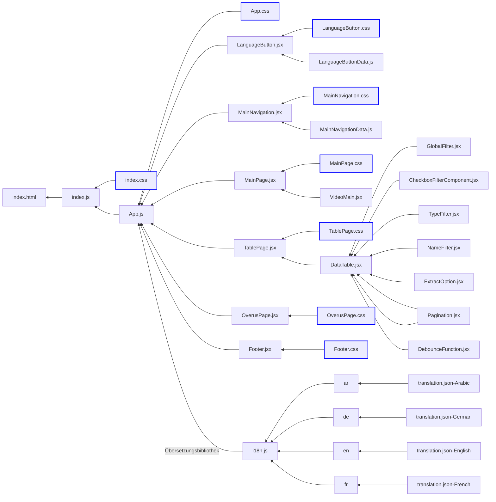

```mermaid


graph RL;
    index.js-->index.html;
    index.css-->index.js;
    style index.css stroke:#0000FF,stroke-width:2px

    App.js-->index.js;
    App.css-->App.js;
    style App.css stroke:#0000FF,stroke-width:2px

    LanguageButton.jsx-->App.js;
    LanguageButton.css-->LanguageButton.jsx;
    style LanguageButton.css stroke:#0000FF,stroke-width:2px
    LanguageButtonData.js-->LanguageButton.jsx;

    MainNavigation.jsx-->App.js;
    MainNavigation.css-->MainNavigation.jsx;
    style MainNavigation.css stroke:#0000FF,stroke-width:2px
    MainNavigationData.js-->MainNavigation.jsx;

        MainPage.jsx-->App.js;
    MainPage.css-->MainPage.jsx;
    style MainPage.css stroke:#0000FF,stroke-width:2px
    VideoMain.jsx-->MainPage.jsx;

    TablePage.jsx-->App.js;
    TablePage.css-->TablePage.jsx;
    style TablePage.css stroke:#0000FF,stroke-width:2px
    DataTable.jsx-->TablePage.jsx;
    GlobalFilter.jsx-->DataTable.jsx;
    CheckboxFilterComponent.jsx-->DataTable.jsx;
    TypeFilter.jsx-->DataTable.jsx;
    NameFilter.jsx-->DataTable.jsx;
    ExtractOption.jsx-->DataTable.jsx;
    Pagination.jsx-->DataTable.jsx;
    DebounceFunction.jsx-->DataTable.jsx;;
    Pagination.jsx-->DataTable.jsx;


    OverusPage.jsx-->App.js;
    OverusPage.css-->OverusPage.jsx;
    style OverusPage.css stroke:#0000FF,stroke-width:2px

    
    
    Footer.jsx-->App.js;
    Footer.css-->Footer.jsx;
    style Footer.css stroke:#0000FF,stroke-width:2px

    i18n.js-->|Übersetzungsbibliothek|App.js;
   
    ar-->i18n.js;
    translation.json-Arabic-->ar;
    de-->i18n.js;
    translation.json-German-->de;
    en-->i18n.js;
    translation.json-English-->en;
    fr-->i18n.js;
    translation.json-French-->fr;

```
