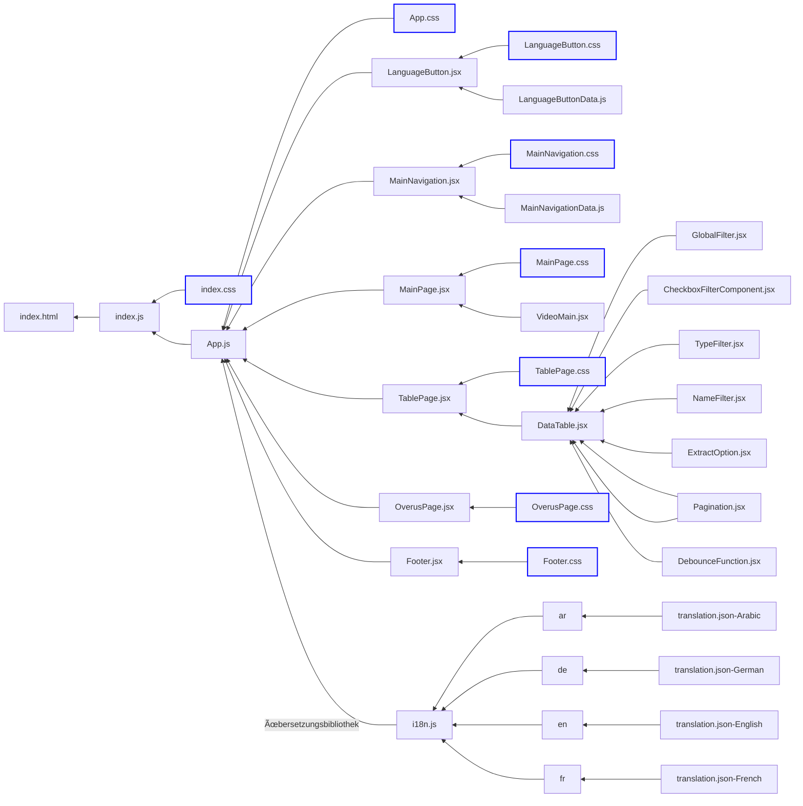

# CO2 Emission Monitor

This project is a modern web application developed for the imaginary NGO "Green Future Energy" to raise awareness about greenhouse gas emissions. The application provides a user-friendly interface to compare CO2 emissions of various countries and companies.

## Key Features

- Responsive design for desktop, tablet, and mobile devices
- Interactive data table with CO2 emission information
- Advanced filtering and sorting capabilities
- Multi-language support (i18n implementation)
- Single-page application (SPA) architecture using React Router

## Technical Stack

- React.js for frontend development
- Node.js as the runtime environment
- Bootstrap for responsive design
- TanStack Table v8 for advanced table functionality
- Git and GitHub for version control and hosting

## Security Measures

- Implemented XSS protection for input fields
- Conducted security testing to ensure data integrity

## Project Structure

The application is built with a modular architecture, featuring:

- A central `App` component
- Header components for navigation and language selection
- Content components including the main page and data table
- Footer component with legal information

## Future Enhancements

Potential areas for future development include:

- Expanded data analysis features
- User profile implementation for personalized content
- Performance optimization for large datasets
- Additional security testing and enhancements

This project demonstrates the use of modern web technologies to create an informative and interactive platform for exploring CO2 emission data.

